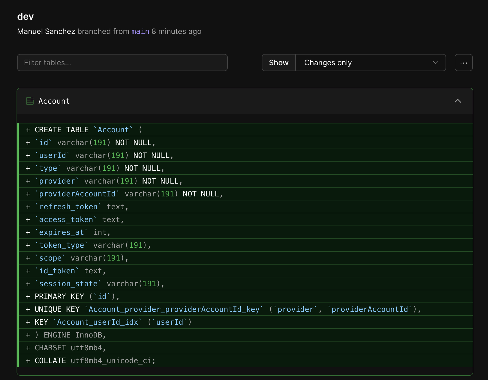

# Clon de Twitter

## 🪜 Setup

Estamos usando el famoso t3 stack con tRPC, TypeScript y Tailwind. Con NextJS y oAuth.

1. npm create t3-app@latest
2. npx prisma db push
3. npm run dev

## 💿 Database

A manera de database estamos utilizando planetscale.
Esta es la página: [https://app.planetscale.com/](https://app.planetscale.com/)

Hay hacemos lo siguiente:

1. Creamos una db con dos branches: production con main y una derivada llamada dev
2. Pedimos los datos de conexión de la de dev
3. Cambiamos la url de la db en el .env y también actualizamos el schema.prisma
4. npx prisma db push

